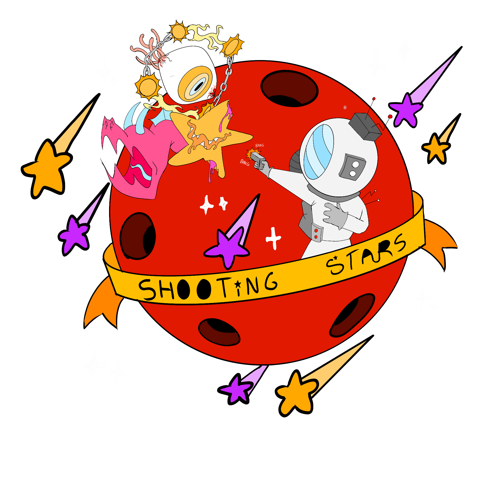

# 🌟 SHOOTING STARS

Juego **shooter espacial pixel** con movimiento horizontal, desarrollado por Manuel, de **12 años**, con la ayuda de su padre.

> Un proyecto de **vibecoding** hecho en familia: Manuel diseña el arte (con **Procreate**), plantea las ideas y genera las instrucciones para el agente de IA, su padre asesora sobre el desarrollo y posibles bugs, y juntos usan **DeepSeek** como motor de IA y **opencode** como interfaz para escribir el código.

---

## 🎮 Qué es

**Shooting Stars** es un juego de naves espaciales en el que controlas a un jugador fijo situado a la izquierda de la pantalla, con un arma que rota en semicírculo (−90° a +90°). Debes disparar a los enemigos que se acercan desde la derecha antes de que crucen tu línea defensiva.

### 🚀 Reglas del juego

- **El jugador** está fijo a la izquierda, en el centro vertical. Su arma rota en un semicírculo de **−90° a +90°** para apuntar a los enemigos.
- **Controles:**
  - 🖱️ **Ratón** para apuntar.
  - **Clic** o **Espacio** para disparar.
  - **W/S** o **Flechas ↑/↓** para rotar el arma.
  - **1 / 2 / 3** para activar los power ups guardados en el inventario.
- **Enemigos:** se mueven verticalmente y se acercan lentamente hacia ti. Algunos **rebotan** en los límites y otros **oscilan**.
  - **Enemigo básico:** 1 punto.
  - **Enemigo variante naranja** (más resistente): 3 puntos.
  - **BOSS:** 10 puntos, aparece a los 60 segundos (o en cada fase).
- **Daño:** si un enemigo cruza tu línea defensiva, pierdes **−10 % de vida**.
- **Vida:** empiezas con **100**. La partida acaba cuando llegas a **0**.
- **Power ups** (coge las estrellas que caen con tus balas y guárdalas en el inventario de 3 casillas):
  - 💛 **BIG BOY** — tus balas se hacen 3× más grandes durante 20s.
  - 💚 **HEALING STATION** — cura el 50% de tu vida.
  - 🧡 **BIG BOOM** — explosión de pantalla completa que daña a todos los enemigos.
  - 💙 **RIOT SHIELD** — escudo azul que absorbe el daño antes que tu vida.
- **Tienda de armas:** al derrotar al BOSS puedes entrar en la **TIENDA** y comprar nuevas armas con tus puntos (BLASTER, REVOLVER, UZI).
- **Fases:** al derrotar al BOSS superas una **fase** (WAVE COMPLETED), atraviesas un túnel de velocidad de la luz y la dificultad aumenta.
- **Récords:** tu mejor puntuación se guarda automáticamente en tu navegador.

---

## 🛠️ Tecnología

| Tecnología | Uso |
|------------|-----|
| **Phaser 3** | Motor de juego (HTML plano + CDN) |
| **HTML / CSS / JS** | Estructura y módulos |
| **DeepSeek** | Motor de IA para el vibecoding |
| **opencode** | Interfaz de desarrollo |
| **Procreate** | Arte y diseños originales |

Todo el arte del juego (logo, enemigos, BOSS, planetas, power ups) es dibujado por Manuel con **Procreate** y se integra mediante imágenes propias en `assets/`.

---

## 📂 Estructura del proyecto

```
SHOOTING STARS/
├── index.html               # CDN Phaser 3 + carga de módulos
├── css/style.css
├── assets/                  # Arte (logo, enemigos, BOSS, planetas, power ups)
└── js/
    ├── config.js            # constantes ajustables
    ├── main.js              # instancia Phaser.Game + RecordSystem
    ├── scenes/
    │   ├── BootScene.js     # pantalla de inicio (logo, estrellas, intro) + récord
    │   ├── GameScene.js     # gameplay, spawns, colisiones
    │   ├── UIScene.js       # HUD + game over + récords
    │   └── ShopScene.js     # tienda de armas
    ├── objects/
    │   ├── Player.js        # player fijo + arma giratoria
    │   ├── Bullet.js
    │   ├── Enemy.js         # enemigo + variantes
    │   ├── Boss.js          # jefe (10 pts, 60s)
    │   ├── Explosion.js     # explosión al matar enemigos/BOSS
    │   ├── Star.js          # estrellas fugaces del fondo
    │   ├── Planet.js        # capas parallax de planetas
    │   └── PowerUp.js       # estrella de power up que cae desde arriba
    └── systems/
        ├── InputHandler.js  # ratón (apuntar/disparar) + teclado
        ├── EnemySpawner.js  # oleadas crecientes + boss
        ├── ScoreSystem.js   # puntos por kill
        ├── RecordSystem.js  # mejor récord en localStorage
        └── PowerUpSystem.js # spawn + inventario de power ups
```

---

## 🚀 Cómo jugar

1. Abre **`index.html`** en un navegador.
2. Pulsa **ENTER** (o haz clic) para pasar la intro animada.
3. ¡Sobrevive a las oleadas, derrota al BOSS y consigue el récord más alto!

> **Nota:** el juego requiere conexión a internet para cargar Phaser 3 desde el CDN.

---

## 📋 Progreso del proyecto

Todo el detalle de fases implementadas, ajustes de gameplay, la historia de bugs resueltos y las ideas futuras están documentados en el fichero **[`PLAN.md`](PLAN.md)**.

En él se registran las **38 fases completadas**, desde el scaffold inicial hasta el sistema de armas y la tienda, así como la estructura de carpetas, la verificación de sintaxis y el **historial de incidencias** resuelto durante el desarrollo.

---

## 🙌 Hecho por

**MANUEL (12 años)** y su padre, con el diseño en **Procreate** y el desarrollo guiado por **DeepSeek** + **opencode**.

> **¡Que no te desintegren las estrellas!** 🌠
