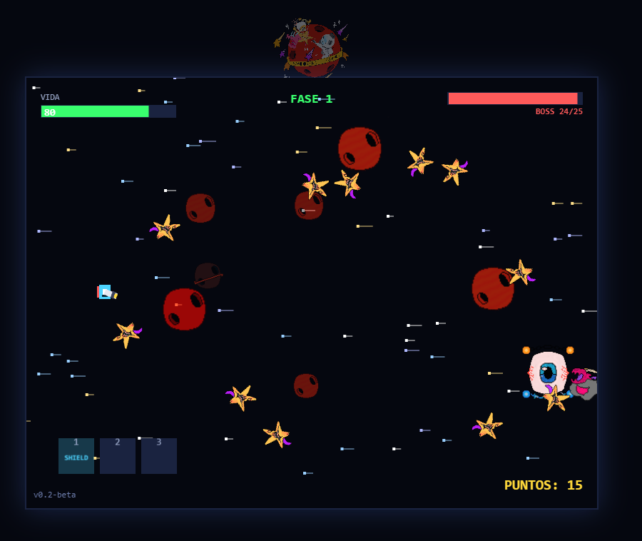

# 🌟 SHOOTING STARS

Juego **shooter espacial pixel** con movimiento horizontal, desarrollado por Manuel, de **12 años**, con la ayuda de su padre.

> Un proyecto de **vibecoding** hecho en familia: Manuel diseña el arte (con **Procreate**), plantea las ideas y genera las instrucciones para el agente de IA, su padre asesora sobre el desarrollo y posibles bugs, y juntos usan **DeepSeek** como motor de IA y **opencode** como interfaz para escribir el código.

---

## 🌐 Juega online e instálalo en cualquier dispositivo

▶️ **Juega a la versión actual:** **[https://shootingstars.ideasypruebas2.es](https://shootingstars.ideasypruebas2.es)**

Desde esa URL puedes **jugar directamente** en el navegador (móvil en horizontal o en el ordenador) e **instalar el juego como PWA**:

- 📱 **Android (Chrome):** abre la URL → menú ⋮ (o el aviso "Instalar app") → **"Instalar aplicación"**. Se añadirá el icono a la pantalla de inicio.
- 🍎 **iPhone/iPad (Safari):** abre la URL → botón **Compartir** → **"Añadir a pantalla de inicio"**.
- 💻 **Windows / Mac / Linux (Chrome o Edge):** abre la URL → icono de instalación de la barra de direcciones → **"Instalar"**.

El juego está pensado para jugarse **en horizontal** (si el móvil está en vertical, te pedirá girar el dispositivo). Instalado como PWA funciona **offline** gracias a su service worker y **se actualiza solo**: cuando hay una versión nueva, la app avisa con **"NUEVA VERSIÓN DESCARGADA"**.

---

## 🎮 Qué es

**Shooting Stars** es un juego de naves espaciales en el que controlas a un jugador fijo situado a la izquierda de la pantalla, con un arma que rota en semicírculo (−90° a +90°). Debes disparar a los enemigos que se acercan desde la derecha antes de que crucen tu línea defensiva.

### 🚀 Reglas del juego

- **El jugador** está fijo a la izquierda, en el centro vertical. Su arma rota en un semicírculo de **−90° a +90°** para apuntar a los enemigos.
- **Controles:**
  - 🖱️ **Ratón** para apuntar.
  - **Clic** o **Espacio** para disparar.
  - **W/S** o **Flechas ↑/↓** para rotar el arma.
  - **1 / 2 / 3** para activar los power ups guardados en el inventario.
- **Enemigos:** se mueven verticalmente y se acercan lentamente hacia ti. Algunos **rebotan** en los límites y otros **oscilan**.
  - **Enemigo básico:** 1 punto.
  - **Enemigo variante naranja** (más resistente): 3 puntos.
  - **BOSS:** 10 puntos, aparece a los 60 segundos (o en cada fase).
- **Daño:** si un enemigo cruza tu línea defensiva, pierdes **−10 % de vida**.
- **Vida:** empiezas con **100**. La partida acaba cuando llegas a **0**.
- **Power ups** (coge las estrellas que caen con tus balas y guárdalas en el inventario de 3 casillas):
  - 💛 **BIG BOY** — tus balas se hacen 3× más grandes durante 20s.
  - 💚 **HEALING** — cura el 50% de tu vida.
  - 🧡 **BIG BOOM** — explosión de pantalla completa que daña a todos los enemigos.
  - 💙 **SHIELD** — escudo azul que absorbe el daño antes que tu vida.
  - ⏸ **TIMESTOP** — congela a los enemigos 5s: pantalla grisácea + cuenta atrás.
  - 💣 **GRANADE** — disparas 10 granadas parabólicas (1s entre disparos) que explotan en 1/8 de pantalla.
- **Tienda de armas:** al derrotar al BOSS puedes entrar en la **TIENDA**. Con tus puntos compras armas nuevas (REVOLVER, SHOTGUN, UZI) que se quedan guardadas durante la partida; después puedes **EQUIPAR** en cualquier momento cualquiera de las que ya tengas. El arma equipada se dibuja en el cañón del jugador.
- **Fases:** al derrotar al BOSS superas una **fase** (VICTORY + WAVE COMPLETED), atraviesas un túnel de velocidad de la luz y la dificultad aumenta.
- **Récords:** tu mejor puntuación se guarda automáticamente en tu navegador.
- **Sonido:** música de fondo en la partida, música propia al aparecer el BOSS, y efectos de sonido de disparo, explosión y daño.

---

## 🎨 Galería de arte

Todo el arte está dibujado por Manuel con **Procreate** e integrado en el juego mediante imágenes propias en `assets/`.

### Power ups
- [💛 **BIG BOY**](assets/Big_Boy.png) — hace tus balas 3× más grandes.
- [🧡 **BIG BOOM**](assets/Big_Boom.png) — explosión de pantalla completa.
- [💚 **HEALING**](assets/Heal.png) — cura el 50% de tu vida.
- [💙 **SHIELD**](assets/Shield.png) — escudo que absorbe el daño.
- [⏸ **TIMESTOP**](assets/Time_Stop.png) — congela a los enemigos.
- [💣 **GRANADE**](assets/Granade.png) — dispara granadas parabólicas.

### Armas
- [🚀 **BLASTER**](assets/logo.png) — el arma inicial, siempre disponible (usa la nave del jugador).
- [🔫 **REVOLVER**](assets/Revolver.png) — daño 3, cadencia 0.5s, 60 pts.
- [🔫 **SHOTGUN**](assets/Shotgun.png) — 3 balas en abanico (±10°), daño 2, cadencia 0.8s, 200 pts.
- [🔫 **UZI**](assets/Uzi.png) — ráfaga rápida de bajo daño, 500 pts.

### Fondo
- [🪐 **Planeta protector**](assets/Back_Planet.png) — planeta de fondo pegado al borde izquierdo que protege al jugador.

### Enemigos
- [👾 **BOSS**](assets/boss.png) — el jefe de cada fase.
- [👾 **BOSS 2**](assets/boss2.png) — variante del jefe.
- [👾 **BOSS 3**](assets/boss3.png) — variante del jefe.
- [✨ **Enemigo básico**](assets/estrella.png) — la estrella que gira y se acerca.
- [🌠 **Enemigo variante**](assets/estrella2.png) — la estrella naranja, más resistente.

---

## 🛠️ Tecnología

| Tecnología | Uso |
|------------|-----|
| **Phaser 3** | Motor de juego (HTML plano + CDN) |
| **HTML / CSS / JS** | Estructura y módulos |
| **DeepSeek** | Motor de IA para el vibecoding |
| **opencode** | Interfaz de desarrollo |
| **Procreate** | Arte y diseños originales |

Todo el arte del juego (logo, enemigos, BOSS, planetas, power ups) es dibujado por Manuel con **Procreate** y se integra mediante imágenes propias en `assets/`.

---

## 📂 Estructura del proyecto

```
SHOOTING STARS/
├── index.html               # CDN Phaser 3 + carga de módulos + metas PWA/Open Graph
├── manifest.webmanifest     # PWA: instalable (standalone)
├── sw.js                    # Service Worker (network-first + modo offline)
├── robots.txt               # permite a los crawlers (Facebook/WhatsApp)
├── css/style.css
├── assets/                  # Arte (logo, enemigos, BOSS, planetas, power ups)
│   ├── audio/               # Música de fondo, del BOSS y de victoria
│   └── icons/               # iconos PWA + imagen para compartir en redes
└── js/
    ├── config.js            # constantes ajustables
    ├── main.js              # instancia Phaser.Game + RecordSystem
    ├── scenes/
    │   ├── BootScene.js     # pantalla de inicio (logo, estrellas, intro) + récord
    │   ├── GameScene.js     # gameplay, spawns, colisiones
    │   ├── UIScene.js       # HUD + game over + récords
    │   └── ShopScene.js     # tienda de armas
    ├── objects/
    │   ├── Player.js        # player fijo + arma giratoria
    │   ├── Bullet.js
    │   ├── Enemy.js         # enemigo + variantes
    │   ├── Boss.js          # jefe (10 pts, 60s)
    │   ├── Explosion.js     # explosión al matar enemigos/BOSS
    │   ├── Star.js          # estrellas fugaces del fondo
    │   ├── Planet.js        # capas parallax de planetas
    │   ├── PowerUp.js       # estrella de power up que cae desde arriba
    │   └── Grenade.js       # granada parabólica del power up GRANADE
    └── systems/
        ├── InputHandler.js  # ratón (apuntar/disparar) + teclado
        ├── EnemySpawner.js  # oleadas crecientes + boss
        ├── ScoreSystem.js   # puntos por kill
        ├── RecordSystem.js  # mejor récord en localStorage
        ├── PowerUpSystem.js # spawn + inventario de power ups
        └── SoundFX.js       # efectos de sonido procedurales (Web Audio)
```

---

## 🚀 Cómo jugar

1. Entra en **[https://shootingstars.ideasypruebas2.es](https://shootingstars.ideasypruebas2.es)** (o abre **`index.html`** en local para desarrollo).
2. Pulsa **ENTER** (o haz clic / toca la pantalla) para pasar la intro animada.
3. ¡Sobrevive a las oleadas, derrota al BOSS y consigue el récord más alto!
4. En el móvil, usa el botón **⛶** para jugar a pantalla completa (o instala la app como PWA, ver sección anterior).

> **Nota:** la primera carga requiere conexión a internet para descargar Phaser 3 desde el CDN. Una vez instalada como PWA, el juego queda disponible **sin conexión**.

---

## 📋 Progreso del proyecto

Todo el detalle de fases implementadas, ajustes de gameplay, la historia de bugs resueltos y las ideas futuras están documentados en el fichero **[`PLAN.md`](PLAN.md)**.

En él se registran las **58 fases completadas**, desde el scaffold inicial hasta el sistema de armas y la tienda, la versión responsive/PWA, el planeta protector, los nuevos power ups (TIMESTOP y GRANADE) y el sonido (música y efectos), así como la estructura de carpetas, la verificación de sintaxis y el **historial de incidencias** resuelto durante el desarrollo.

Entre las últimas mejoras: la nueva arma **SHOTGUN**, el **sistema de armas compradas** con botón **EQUIPAR** y ticks verdes en la lista, la **tienda rediseñada** (caja de información con sprite del arma, imágenes de la tienda que cambian y animación al comprar), la **victoria para todos los BOSS** (mensaje + música + tienda en cada fase), y el **temporizador de aparición** de enemigos y BOSS ligado al inicio real de la partida.

---

## 🙌 Hecho por

**MANUEL (12 años)** y su padre, con el diseño en **Procreate** y el desarrollo guiado por **DeepSeek** + **opencode**.

> **¡Que no te desintegren las estrellas!** 🌠

---

## 🖼️ Capturas


